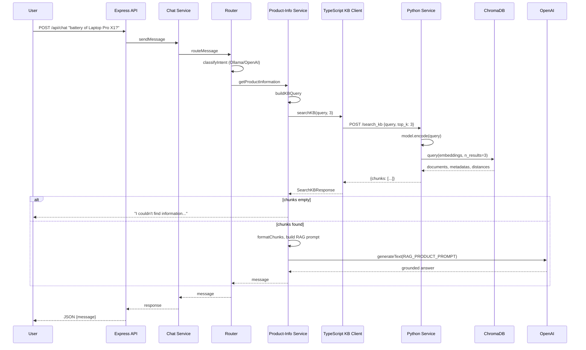

# RAG Architecture Overview

## Overview

This application is a multi-intent chatbot that uses Retrieval-Augmented Generation (RAG) for product-related queries. Users ask questions about products (e.g., Laptop Pro X1, Smart Watch S5); the system retrieves relevant chunks from a document store, injects them into a prompt, and generates an answer from that context. The RAG path is one of several intents; others include weather, exchange rates, math, and review analysis.

## The Problem: Hallucination

LLMs generate plausible but incorrect information when answering from memory alone. For product specs, prices, or technical details, inventing data is unacceptable. Hallucination increases when the model lacks domain data or when questions are ambiguous. The solution is to constrain the model to answer only from provided context.

## Why RAG

RAG addresses hallucination by:

1. **Retrieving** relevant passages from a trusted corpus (product docs)
2. **Injecting** those passages into the prompt as the sole source of truth
3. **Instructing** the model to answer strictly from the passages and to say "I don't know" when the answer is absent

This shifts correctness from model memory to the retrieval and grounding step. The model acts as a summarizer/paraphraser of retrieved content, not as a fact store.

## System Architecture

### Component Map

```
┌─────────────┐     ┌──────────────────────────────────────────────────────────────┐
│   React     │     │                    Express (TypeScript)                       │
│   Client    │────▶│  Chat Controller → Chat Service → Router / Planner            │
└─────────────┘     │       → Product-Info Service → searchKB (HTTP)                │
                    └──────────────────────────────────────────────────────────────┘
                                         │                          │
                                         ▼                          ▼
                    ┌────────────────────────────┐    ┌─────────────────────────────┐
                    │  Python FastAPI (port 8000) │    │  Ollama (router, general)    │
                    │  - /search_kb               │    │  OpenAI (RAG, fallbacks)     │
                    │  - /analyze (sentiment)    │    └─────────────────────────────┘
                    │  KBService: embeddings +   │
                    │  ChromaDB queries          │
                    └────────────────────────────┘
                                         │
                                         ▼
                    ┌────────────────────────────┐
                    │  ChromaDB (chroma_db/)     │
                    │  Collection: products     │
                    │  HNSW, cosine similarity   │
                    └────────────────────────────┘
```

### Responsibilities

| Component                | Role                                                                                   |
| ------------------------ | -------------------------------------------------------------------------------------- |
| **API layer**            | Receives user message, returns assistant reply. Stateless.                             |
| **Chat service**         | Branches on USE_PLAN: planner path or router path.                                     |
| **Router**               | Classifies intent; dispatches to tools. Uses Ollama first, OpenAI fallback.            |
| **Product-info service** | Builds KB query, calls Python /search_kb, formats chunks, calls OpenAI for generation. |
| **Python service**       | Embeds query, queries ChromaDB, returns chunks. Hosts sentiment pipeline.              |
| **ChromaDB**             | Stores embeddings and chunk text. Persistent on disk.                                  |
| **OpenAI**               | RAG answer generation (gpt-4.1), router fallback, synthesis.                           |

### Stateless vs Stateful

- **Stateless:** Express server, chat service, router, plan executor, product-info service
- **Stateful:** Python service (loaded models), KBService (model + Chroma client), ChromaDB, conversation repository (history.json)

### Data Persistence

- **chroma_db/**: Vector index (embeddings + chunk text). Created by `index_kb.py`.
- **history.json**: Conversation history. In-memory + periodic save.
- **data/products/**: Source .txt files. Not a runtime store; used only during indexing.

---

## Query Flow

### Logical Steps (Product RAG)

1. User sends: "What's the battery life of Laptop Pro X1?"
2. Chat service receives message; USE_PLAN off → routeMessage.
3. Classifier: intent = getProductInformation, product_name = "Laptop Pro X1", query = "battery".
4. Router calls getProductInformation("Laptop Pro X1", "battery", originalQuestion).
5. buildKBQuery returns: "Laptop Pro X1 battery What's the battery life of Laptop Pro X1?"
6. searchKB(kbQuery, 3) → POST to http://localhost:8000/search_kb.
7. Python: SentenceTransformer encodes query → 384-dim vector.
8. ChromaDB: collection.query(embedding, n_results=3) → top-3 by cosine similarity.
9. Python returns chunks with text, metadata (source, chunk_index), score.
10.   Product-info: if chunks empty → "I couldn't find information..."
11.   Product-info: formatChunks → concatenate with source labels.
12.   RAG_PRODUCT_PROMPT filled with chunks, question, query_token, target_language.
13.   OpenAI generateText(prompt, temperature=0.3, maxTokens=500).
14.   Response returned to user.

### Mermaid Sequence Diagram



---

## Indexing Flow

### Where Chunking Happens

Chunking is done in `services/python/index_kb.py` before embedding. Documents are loaded from `data/products/*.txt`.

### Chunking Strategy

- **Method:** Word-based splitting
- **Chunk size:** 400 words
- **Overlap:** 50 words
- **Boundary preference:** If near end of chunk, prefers last sentence or newline within ~80 chars of end

Relevant logic:

```python
CHUNK_SIZE_WORDS = 400
CHUNK_OVERLAP_WORDS = 50
# Optional: prefer sentence boundary near end
brk = max(last_period, last_newline)
if brk > len(chunk) - 80:
    chunk = chunk[:brk + 1].strip()
```

### Embedding Generation

- **Model:** `sentence-transformers/all-MiniLM-L6-v2`
- **Process:** `model.encode(all_chunks, show_progress_bar=True)` in batch
- **Indexing:** One-off; no incremental or streaming pipeline

### Storage

- **Vector DB:** ChromaDB PersistentClient at `./chroma_db`
- **Collection:** "products", `hnsw:space: cosine`
- **IDs:** `{filename}_{chunk_index}` (e.g., laptop_pro_x1.txt_0)
- **Metadata:** `source`, `chunk_index`, `language`

### Error Handling

- Missing data dir → empty documents list, early exit
- Rebuild flag → delete collection, recreate
- Exceptions → logged, process exits with code 1
- No retries or backoff

---

## Design Decisions

### Tool Separation

- **Python:** Embeddings, ChromaDB, sentiment. No orchestration.
- **TypeScript:** Routing, RAG prompt construction, OpenAI calls.

Rationale: Python has the ML stack (sentence-transformers, ChromaDB); TypeScript owns product logic and API.

### Fixed Top-K

topK=3 is hardcoded. Tradeoff: predictable context size vs. ignoring relevance when the 3rd chunk is weak.

### No Score Threshold

All top-3 chunks are passed to the LLM. Low-similarity chunks can still appear. Mitigation is via prompt: "Answer ONLY from the chunks." A score threshold would reduce this risk.

### Deterministic KB Query

`buildKBQuery(productName, queryToken, originalUserQuestion)` is fully deterministic. No query expansion or rephrasing.

### Bilingual via Prompt

Target language (he/en) is set in the RAG prompt. No separate translation step.

---

## Limitations & Tradeoffs

| Area            | Limitation                                                |
| --------------- | --------------------------------------------------------- |
| **Retrieval**   | No score cutoff; weak chunks can affect output            |
| **Chunk size**  | 400 words may cut mid-sentence or split tables            |
| **Context**     | Only 3 chunks; no reranking or expansion                  |
| **Scalability** | Python single process; ChromaDB embedded, no sharding     |
| **Latency**     | Sequential: embed → query → OpenAI                        |
| **Indexing**    | Manual run; no live update on doc change                  |
| **Fallback**    | Empty retrieval → generic message; no follow-up retrieval |

---

## Future Improvements

1. **Relevance threshold:** Drop chunks below a similarity score before prompting.
2. **Hybrid search:** Combine semantic and keyword (BM25) retrieval.
3. **Dynamic K:** Adjust chunk count by query type or initial score distribution.
4. **Reranking:** Use a cross-encoder to rerank top-K before prompt injection.
5. **Managed vector DB:** Replace ChromaDB with Pinecone/Weaviate/Qdrant for scale.
6. **Async indexing:** Trigger reindex on file change; queue-based pipeline.
7. **Query expansion:** Use an LLM to expand or rephrase the KB query.
